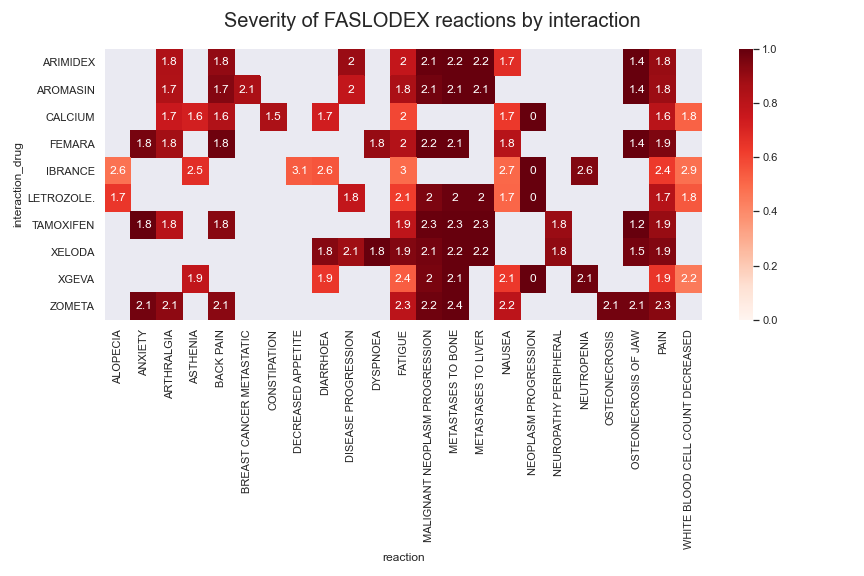

# FAERS Case Study
##### Clay Shwery

FAERS is an FDA database and API of adverse events associated with medicinal products (a broad term, which can include more than pharmaceuticals, but I'll use the term 'drug' here liberally). This case study examines patient reactions and interactions around a group of drugs, namely the 2019 top 10 best selling drugs by AstraZeneca (as found in [this article](https://www.biopharmadive.com/news/astrazeneca-pharma-dive-awards/566229/#:~:text=Lung%20cancer%20drug%20Tagrisso%20has,overtaking%20Symbicort%20earlier%20this%20year.)). 
### Drugs of interest in this case study:
* SYMBICORT
* TAGRISSO
* NEXIUM
* CRESTOR
* FARXIGA
* BRILINTA
* PULMICORT
* FASLODEX
* ZOLADEX
* SELOKEN
* TOPROL-XL

### Fields leveraged for this case study
In order to gather some useful data for exploration, I'll leverage the following [Fields](https://open.fda.gov/apis/drug/event/searchable-fields/)
 in the FAERS API:

* patient.patientsex
    * '1': 'Male', '2': 'Female'
* patient.drug.medicinalproduct
    * This field contains the name of the drugs reported by the patient.
        
* patient.reaction.reactionmeddrapt

    * Patient reaction, as a MedDRA term. Note: MedDRA has a hierarchical organization, and I'd leverage that taxonomy here, but it is a paid/subscription service so I'm unable to for this case study.
    
    * This returns counts of specific patient reaction
* serious

    * Seriousness of the adverse event.
    * Value is one of the following
1 = The adverse event resulted in death, a life threatening condition, hospitalization, disability, congenital anomaly, or other serious condition
2 = The adverse event did not result in any of the above

* patient.patientagegroup

    * '1': 'Recovered/resolved',
  '2': 'Recovering/resolving',
  '3': 'Not recovered/not resolved',
  '4': 'Recovered/resolved with sequelae (consequent health issues)',
  '5': 'Fatal'

### Data Exploration
In order to quickly acquire data to explore and manipulate, I created a class to enable easy interaction with the API for my purposes. This is available [here](https://github.com/cshwery/faers_ml/blob/master/src/data/helpers.py). This allows me to quickly create a dataset for exploratory visualization, which I did with the following design:
* Iterate through the drugs listed above (initial_drug)
    * For each drug, identify the 10 drugs which co-occur with the initial drug most frequently in the database ('interaction_drug').
        * For each (initial_drug,interaction_drug) pair get the top 10 most frequent reactions.
        * For each (initial_drug,interaction_drug,reaction) combination, partition it by whether or not it was serious
* Visualize the results in a heat map. In particular, visualize the the % of an outcome involving that interaction pair. This is done by dividing the count of times the drug was co-incident with another drug by how many times the initial_drug was associated with a specific reaction.

To gather the data the following code was leveraged in this [notebook](https://github.com/cshwery/faers_ml/blob/master/notebooks/1.1-ces-faers_exploration.ipynb)
```python
import pandas as pd
import sys
#put root in path
sys.path.append('../')
from src.data import helpers
from copy import deepcopy
import os
from dotenv import load_dotenv
import time
load_dotenv()

#will only work with following key in environment variables or in .env
os.environ['fda_api_key']

faersApi = helpers.FaersApi()

# Partially pre-loaded config dicts to make code less verbose
params_10_interacts = {'search': {'receivedate': '[20040101+TO+20201024]'}#,'patient.drug.medicinalproduct':'symbicort'.upper()}
                       , 'count':'patient.drug.medicinalproduct.exact'
                       , 'limit':11
                      } #11 because drug will be listed in the results
params_10_reacts = {'search': {'receivedate': '[20040101+TO+20201024]'}#,'patient.drug.medicinalproduct':'symbicort'.upper()}
                    , 'count':'patient.reaction.reactionmeddrapt.exact'
                    , 'limit':10
                   }
params_serious = {'search': {'receivedate': '[20040101+TO+20201024]'}#,'patient.drug.medicinalproduct':'symbicort'.upper()}
                  , 'count':'serious'
                 }

a_z_drugs = ['symbicort','tagrisso','nexium','crestor','farxiga','brilinta','pulmicort','faslodex','zoladex','seloken','toprol-xl']
A_Z_drugs = [drug.upper() for drug in a_z_drugs]
A_Z_drugs

def pause_if_required(query_count):
    "Simple function to avoid fda api 240 requests/minute rate limit"
    if query_count >= 220:
        print('pausing for 60 seconds')
        time.sleep(60)
        return 0
    else:
        return query_count

failed_drug_queries = []
query_count = 0
initialized = False
for initial_drug in A_Z_drugs:
    #Get top 10 interactions
    _params_10_interacts_ = deepcopy(params_10_interacts)
    _params_10_interacts_['search'].update({'patient.drug.medicinalproduct':initial_drug})
    #print(params_10_interacts)
    try:
        query_count = pause_if_required(query_count)
        initial_results = faersApi.make_call(_params_10_interacts_).json()['results']
        query_count +=1
        print(f'fetching co-occuring drug data for {initial_drug}')
    except KeyError:
        # This occurs when a search for a given drug fails to return any results
        failed_drug_queries.append(initial_drug)
        print(f'{initial_drug} query did not return results')
        query_count +=1
        continue
    for interaction_drug in [res['term'] for res in initial_results]:
        _params_10_reacts_ = deepcopy(params_10_reacts)
        _params_10_reacts_['search'].update({'patient.drug.medicinalproduct':initial_drug,
                                             'patient.drug.medicinalproduct.exact':interaction_drug})
        try:
            query_count = pause_if_required(query_count)
            interaction_results = faersApi.make_call(_params_10_reacts_).json()['results']
            query_count += 1
            print(f'\tfetching reactions data for ({initial_drug},{interaction_drug})')
        except KeyError:
            failed_drug_queries.append((initial_drug,interaction_drug))
            print(f'({initial_drug},{interaction_drug}) query did not return results')
            query_count +=1
            continue
        for reaction in [res['term'] for res in interaction_results]:
            init_int_react_params = deepcopy(params_serious)
            init_int_react_params['search'].update({'patient.drug.medicinalproduct':initial_drug,
                                          'patient.drug.medicinalproduct.exact':interaction_drug,
                                          'patient.reaction.reactionmeddrapt.exact':reaction})
            try:
                query_count = pause_if_required(query_count)
                init_int_react_results = faersApi.make_call(init_int_react_params).json()['results']
                query_count += 1
                print(f'\t\tfetching init/int/react data for {init_int_react_params}')
            except KeyError:
                query_count +=1
                # Try using non-exact reactions
                init_int_react_params = deepcopy(params_serious)
                init_int_react_params['search'].update({'patient.drug.medicinalproduct':initial_drug,
                                                        'patient.drug.medicinalproduct.exact':interaction_drug,
                                                        'patient.reaction.reactionmeddrapt':reaction})
                try:
                    query_count = pause_if_required(query_count)
                    init_int_react_results = faersApi.make_call(init_int_react_params).json()['results']
                    query_count += 1
                    print(f'\t\tfetching non-exact init/int/react data for ({init_int_react_params})')
                except KeyError:
                    failed_drug_queries.append((initial_drug,interaction_drug,reaction))
                    print(f'({initial_drug},{interaction_drug},{reaction}) query did not return results')
                    query_count += 1
                    continue
            # Add the query specific data to the results
            for res in init_int_react_results:
                res.update({'initial_drug':initial_drug,'interaction_drug':interaction_drug,'reaction':reaction})
            if not initialized:
                # make a pd.DataFrame first time, subsequently create temporary df and concatnate to main_df
                df = pd.DataFrame.from_records(init_int_react_results)
                initialized = True
            else:
                df = pd.concat([df,
                                pd.DataFrame.from_records(init_int_react_results)])

df.to_csv('../data/interim/extracted_data.csv',index=False)
```
Typically, I would have my data folder in my .gitignore but I forced git to upload the .csv with the results from above [here](https://github.com/cshwery/faers_ml/blob/master/data/interim/extracted_data.csv).

The following code used for visualization can be found in this [notebook](https://github.com/cshwery/faers_ml/blob/master/notebooks/1.0-ces-faers_viz.ipynb).

```python
import seaborn as sns
sns.set_theme()
import pandas as pd
from copy import deepcopy
import matplotlib.pyplot as plt

df_ = pd.read_csv('../data/interim/extracted_data.csv')

# Cleanup
df_ = df_.reset_index(drop=True).rename({'term':'serious'},axis=1)
# Make the 'serious' column more useful, e.g. make 'Not Serious' into 0, keep 'Serious' as 1
df_.loc[df_['serious']==2,'serious'] = 0

# iterate by initial drug, group by interaction_drug & reaction, prepare data for sns heatmaps
drugs_grouped = {}
for initial_drug in df_['initial_drug'].unique():
    df_drug = df_.loc[df_['initial_drug']==initial_drug]
    grp_records = {}
    for idx, grp in df_drug.groupby(['interaction_drug','reaction']):
        grp_records[idx] = {'count':grp['count'].sum()
                            ,'%serious':grp.loc[grp['serious']==1,'count'].sum()/grp['count'].sum()  
                           }
    drugs_grouped[initial_drug] = deepcopy(grp_records)

# For each drug, we create heatmaps showing the severity of each interaction pair/reaction combination 
# We annotate withh the log of the counts to avoid chasing down small sample size examples
for key,val in drugs_grouped.items():
    # Restructure for sns
    df_drug = pd.DataFrame.from_dict(drugs_grouped[key],orient='index')\
            .reset_index()\
            .rename({'level_0':'interaction_drug','level_1':'reaction'},axis=1)
    df_drug = df_drug.loc[df_drug['interaction_drug']!=key]
    df_severity = df_drug.copy().pivot(index='interaction_drug',columns='reaction',values='%serious')
    df_counts = df_drug.copy().pivot(index='interaction_drug',columns='reaction',values='count')
    # Make the counts into logs so we can read them in annotations
    for col in df_counts:
        df_counts[col] = df_counts[col].apply(lambda x: round(math.log10(x),1))
    fig, ax = plt.subplots(figsize=(12, 8))
    fig.suptitle(f'Severity of {key} reactions by interaction', fontsize=20)
    #plt.title = f'Severity of {key} interactions and reactions'
    ax = sns.heatmap(df_severity,annot=df_counts,vmin=0,vmax=1,cmap=plt.get_cmap('Reds'))
    plt.tight_layout()
    plt.savefig(f'../reports/figures/{key}.png')
```

This allows us to quickly examine a number potential cases to address in further depth. Here is one such heatmap.


The interaction between FASLODEX and XELODA seems like it shows an interesting pattern, with more serious outcomes even when considering reactions that do not have uniform high severity like Fatigue.

### ML and further areas to investigate

To investigate this further (which I won't have time to execute), what I would do is gather records where either FASLODEX or XELODA was used, as well as some noise data for commonly occurring reactions in which neither was drug was administered. 

This code helps acquire the FASLODEX and XELODA training data:

```python
params_faslodex_xeloda = {'search': ['receivedate=[20040101+TO+20201024]'
             ,'(patient.drug.medicinalproduct.exact=faslodex+xeloda)'.upper()
             #,'patient.drug.medicinalproduct.exact':'xeloda'.upper()                      
                                    ]
             #, 'count':'patient.drug.medicinalproduct'
             ,'limit':1000
             #,'skip':30000
            }
results_list = [] 
resp = faersApi.make_call(params_faslodex_xeloda)
results_list.extend(resp.json()['results'])
while resp.links.get('next') and resp.links['next'].get('url'):
    print(resp.links['next'].get('url'))
    resp = requests.get(resp.links['next'].get('url'),auth=HTTPBasicAuth('AxJ349dp7cWgZrO4dYC7mk3M4cTqHqa4n375Fao0',''))
    results_list.extend(resp.json()['results'])
```

Noise data could be acquired by selecting a randomly selected number of records for the top 20 most commonly occuring reactions was present.

Assuming that 'serious' is an acceptable outcome parameter (which is an assumption that would need to be checked), the next major task would be feature engineering. The return acquired using the code will need to be transformed in order to build a model on it. I would use a technique borrowed from NLP and treat the drugs involved as a list of tokens. Then I would use a count vectorizer on those lists, and transform the data into binary variables for each drug administered. This would be very sparse, and variables that are not used frequently enough in the dataset would need to be pared. A similar technique could be applied to transform reactions. I'd also include some numeric data like onset age and potentially weight. Other categorical data that would be included would be gender.

I'd try at first a few models, one of which would be logistic regression since the outcome is a binary (I'd transform the values for the outcome variable from 1=serious/2=not serious to 1=serious/0=not serious) valued variable and this is a classification test. Additionally I'd include interaction effects between certain sets of the categorical variables, in particluar the drugs administered. 

Other potentially valuable approaches would be random forests, and gradient boosted trees. 
